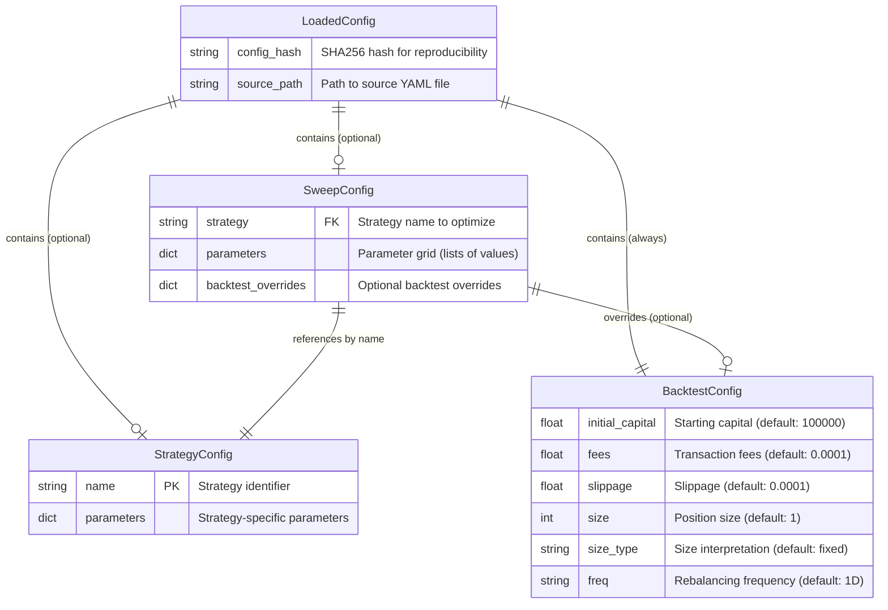

# Configuration Entity Relationship Diagram

This diagram shows the relationships between the configuration dataclasses
used in the Simple Futures Backtester.

## Entity Descriptions

### StrategyConfig
Defines a trading strategy with its name and parameters. The `name` field
serves as the identifier (e.g., "momentum", "mean_reversion", "breakout"),
while `parameters` holds strategy-specific settings as a dictionary.

### BacktestConfig
Contains all settings for executing a backtest:
- **initial_capital**: Starting portfolio value
- **fees**: Transaction costs as a decimal (0.0001 = 0.01%)
- **slippage**: Market impact as a decimal
- **size**: Number of contracts/units per trade
- **size_type**: How size is interpreted ("fixed", "percent", "target")
- **freq**: Trading/rebalancing frequency ("1D", "1H", "5m", etc.)

### SweepConfig
Defines a parameter optimization sweep:
- **strategy**: Name of the strategy to optimize
- **parameters**: Dictionary where keys are parameter names and values are
  lists of values to test (creates a parameter grid)
- **backtest_overrides**: Optional overrides for BacktestConfig during sweep

### LoadedConfig
Container returned by `load_config()` that bundles:
- The parsed configuration objects
- A SHA256 hash of the source YAML for reproducibility tracking
- The resolved file path for audit purposes

## Relationships

1. **LoadedConfig -> StrategyConfig** (optional, 0..1):
   A loaded config may contain a strategy section.

2. **LoadedConfig -> BacktestConfig** (required, 1):
   A loaded config always has backtest settings (with defaults if not specified).

3. **LoadedConfig -> SweepConfig** (optional, 0..1):
   A loaded config may contain a sweep section.

4. **SweepConfig -> StrategyConfig** (reference):
   A sweep references a strategy by name (not by object).

5. **SweepConfig -> BacktestConfig** (optional override):
   A sweep may override backtest settings via `backtest_overrides`.

## Environment Variable Overrides

BacktestConfig fields can be overridden via environment variables:

| Environment Variable | Field |
|---------------------|-------|
| `SFB_CAPITAL` or `SFB_BACKTEST_INITIAL_CAPITAL` | initial_capital |
| `SFB_FEES` or `SFB_BACKTEST_FEES` | fees |
| `SFB_SLIPPAGE` or `SFB_BACKTEST_SLIPPAGE` | slippage |
| `SFB_SIZE` or `SFB_BACKTEST_SIZE` | size |
| `SFB_BACKTEST_SIZE_TYPE` | size_type |
| `SFB_BACKTEST_FREQ` | freq |
